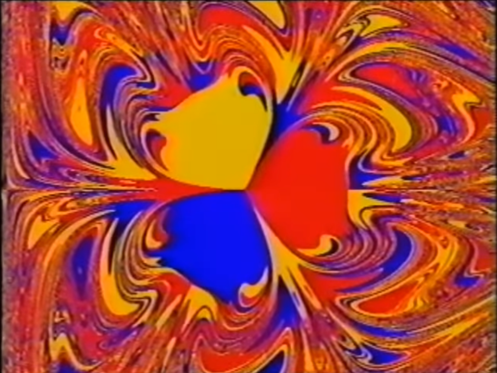

# Péndulo y Fractal

Recreando la simulación de [mi video favorito](https://www.youtube.com/watch?v=C5Jkgvw-Z6E) de YouTube.

## ¿De qué va?

Es una simulación de un péndulo que además de la gravedad está sometido a la fuerza de tres imanes:

Según el video, si se suelta el péndulo desde cualquier posición inicial, éste termina deteniéndose sobre uno de los tres imanes.

El objetivo principal de la simulación es mapear sobre cual imán se detiene el péndulo para cada posición inicial, lo cual genera un fractal:

## ¿Qué hay acá?

En este repositorio intento replicar la simulación del video, y hacer alguna visualización interactiva.

El código de la simulación, junto con una descripción del modelo usado, está en `source/modelo`.