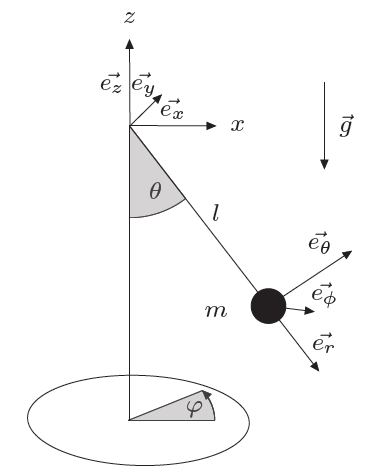

# Campos de Fuerza

Acá se definen los campos de fuerza que actuan o pueden actuar sobre el péndulo.

En realidad, se definen como campos de aceleración, o fuerza por unidad de masa, para simplificar las cuentas.

*Repasemos el sistema de coordenadas:*

## Gravedad

La fuerza de la gravedad sobre el péndulo es:

$$
\mathbf{F_g}
= -m \ g \cdot \mathbf{e_z}
= m \ g \ \cos{\theta} \cdot \mathbf{e_r} -m \ g \ \sin{\theta} \cdot \mathbf{e_\theta}
$$

Pero la comonente radial no nos interesa, así que la fuerza de la gravedad sobre el péndulo es:

$$
\mathbf{F_g}
= -m \ g \ \sin{\theta} \cdot \mathbf{e_\theta} + 0 \cdot \mathbf{e_\varphi}
$$

La aceleración del Péndulo a causa de la gravedad es:

$$
\mathbf{a_g} = \frac{\mathbf{F_g}}{m}
= - g \ \sin{\theta} \cdot \mathbf{e_\theta} + 0 \cdot \mathbf{e_\varphi}
$$