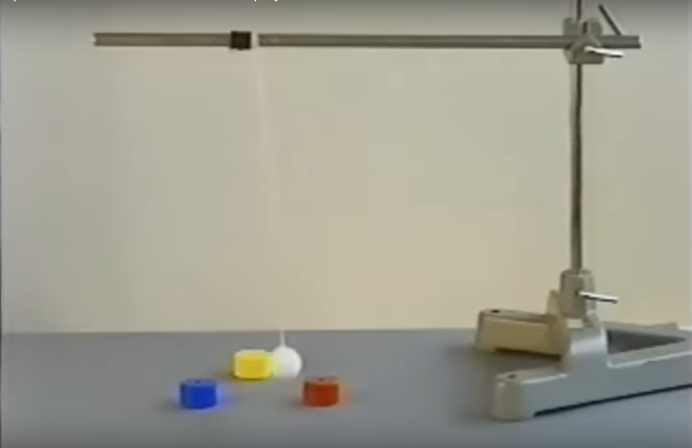

# El Sistema a Ser Simulado

El sistema que queremos simular es un péndulo formado por una bola de hierro que cuelga de un hilo sobre tres imanes:

## Parámetros

El sistema tiene muchos parámetros que pueden ser variados y/o generalizados.

La siguiente es una lista actualizada de todos los parámetros incorporados en la simulación:

- Aceleración de la gravedad
- Longitud del péndulo

Estimando a ojo en base a las imágenes del video, definimos el siguiente conjunto de valores como la configuración canónica:

- Longitud del péndulo: 35 cm
- Altura del péndulo (con respecto a los imanes): 36 cm
- Número de imanes: 3
- Distribución de los imanes: triangular centrada, radio 10 cm

## Coordenadas

Por la naturaleza esférica del movimiento del péndulo, sus ecuaciones de movimiento se van a escribir en coordenadas esféricas. Las cuentas relacionadas al campo magnético, en cambio, se hacen en coordenadas cartesianas.

Definimos el origen de coordenadas para ambos sistemas en el punto fijo del péndulo.

El sistema de coordenadas cartesianas tiene los ejes $x$ e $y$ en el plano horizontal, y el eje $z$ apuntando hacia arriba.

El sistema de coordenadas esféricas mide $\theta$ desde el eje $-z$ hacia arriba, y $\varphi$ desde el eje $x$ hacia el eje $y$.

## Modelo Mecánico

El estado del sistema está definido por la posición y velocidad del péndulo. Esta información se representa en un `Vector4D`:

$$
\mathbf{u} = (\theta, \varphi, \dot{\theta}, \dot{\varphi})
$$

Las librerías de ecuaciones diferenciales requieren que describamos el sistema con una ecuación de la forma $\dot{\mathbf{u}} = f(\mathbf{u}, t, p \dots)$, donde $\mathbf{u}$ es el vector de estado, $t$ es el tiempo, y $p\dots$ son los parámetros del sistema.

En nuestro caso, la derivada del vector de estado es $\dot{\mathbf{u}} = (\dot{\theta}, \dot{\varphi}, \ddot{\theta}, \ddot{\varphi})$, donde $\ddot{\theta}$ y $\ddot{\varphi}$ se calculan en función del estado actual y las fuerzas que actúan sobre el péndulo, como se deriva a continuación:

Comenzamos con la ecuación archiconocida:

$$
\mathbf{F} = m \cdot \mathbf{a}
$$

Donde las fuerzas externas y la masa del péndulo son conocidas. Despejamos la aceleración:

$$
\frac{\mathbf{F}}{m} = \mathbf{a}
$$

El lado izquierdo de la ecuación es el campo de aceleración debido a las fuerzas externas, y se calcula con las funciones definidas en `???`.

Resta escribir la aceleración en coordenadas esféricas para despejar $\ddot{\theta}$ y $\ddot{\varphi}$. Para esto recurrimos a [Wikipedia](https://en.wikipedia.org/wiki/Spherical_coordinate_system#Kinematics), pero simplificamos las expresiones usando el hecho de que el radio es constante. Se obtiene esta expresión:

$$
\mathbf{a} =
r(\ddot{\theta} - \dot{\varphi}^2 \sin{\theta} \cos{\theta})\cdot \mathbf{e_\theta}
+ r(\ddot{\varphi} \sin{\theta} + 2\ \dot{\theta}\ \dot{\varphi}\ \cos{\theta}) \cdot \mathbf{e_\varphi}
$$

Separando esta ecuación en las dos componentes ($\theta$ y $\varphi$), podemos despejar $\ddot{\theta}$ y $\ddot{\varphi}$:

$$
\ddot{\theta} = \frac{a_\theta}{r} + \dot{\varphi}^2\sin{\theta}\cos{\theta}
$$

$$
\ddot{\varphi} = \frac{1}{\sin{\theta}} \left( \frac{a_\varphi}{r} - 2\ \dot{\theta}\ \dot{\varphi} \cos{\theta} \right)
$$

En conclusión, el modelo está implementado en los siguientes pasos:

1. Definir el vector de estado como $\mathbf{u} = (\theta, \varphi, \dot{\theta}, \dot{\varphi})$.
2. Definir el campo de aceleración del péndulo, $\mathbf{a}(\mathbf{u})$, en base a las fuerzas externas.
3. Definir la función de evolución del sistema como $f(\mathbf{u}, t, p \dots) = \dot{\mathbf{u}}(\mathbf{u}, t, p \dots) = (\dot{\theta}, \dot{\varphi}, \ddot{\theta}, \ddot{\varphi})$, donde $\ddot{\theta}$ y $\ddot{\varphi}$ se calculan a partir de $\mathbf{a}(\mathbf{u})$.
4. Pasar la función de evolución del sistema y el estado inicial a la librería `DynamicalSystems.jl`, que se encarga de integrar las ecuaciones diferenciales y calcular la trayectoria del péndulo.

## Campos de Aceleración

Lo único que falta es calcular los campos de aceleración del péndulo.

### Gravedad

La fuerza de la gravedad sobre el péndulo es:

$$
\mathbf{F_g}
= -m \ g \cdot \mathbf{e_z}
= m \ g \ \cos{\theta} \cdot \mathbf{e_r} - m \ g \ \sin{\theta} \cdot \mathbf{e_\theta} + 0 \cdot \mathbf{e_\varphi}
$$

Pero la componente radial no nos interesa porque el radio es constante, así que la fuerza de la gravedad sobre el péndulo es:

$$
\mathbf{F_g}
= -m \ g \ \sin{\theta} \cdot \mathbf{e_\theta} + 0 \cdot \mathbf{e_\varphi}
$$

La aceleración del péndulo a causa de la gravedad es:

$$
\mathbf{a_g} = \frac{\mathbf{F_g}}{m}
= - g \ \sin{\theta} \cdot \mathbf{e_\theta} + 0 \cdot \mathbf{e_\varphi}
$$